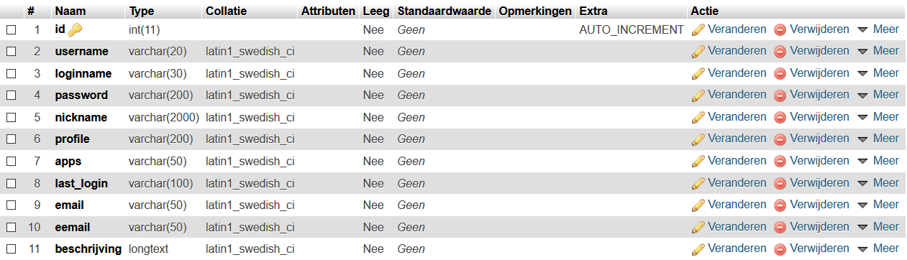
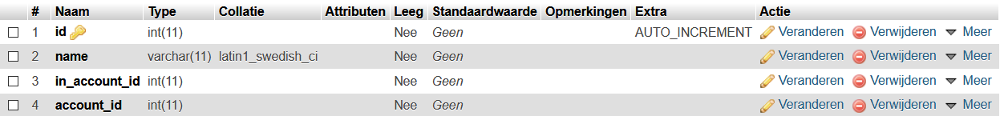
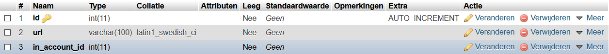
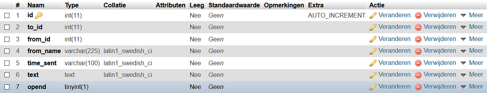
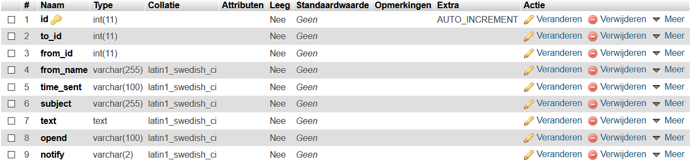

# Nindo


Small social media platform written in PHP.  

I made this because I could. I just wanted to know if I could pull it off. And I did it.  
Nindo supports posts, likes, friends, images, private messages / DM's and chatrooms. I decided to shut it down on Janurary 1st 2021 due to inactivity.

## The story

Just like my entire website back then, Nindo was meant to be used by secret agents. Me and my friends had this thing called the DDDD, which was a secret organisation to protect the universe from the bad guys called humans. At first Nindo was called the "DGAW", which was an abbreviation for "De Geheim Agenten Webapp". Nindo was a part of it which was made for Ninjas, thats where the name came from. Later I just called the entire platform Nindo, just because I liked the name. I sadly don't have any backups of the UGLY first versions of the platform.

## Self hosting Nindo

True, Nindo is offline, but if you want you can host it yourself. All you need is a webserver that has access to a database and a PHP backend. Do you want to know how? Follow the guide below. The entire source code and the platform itself is in Dutch tough...

### STEP 1: Get a server

You'll need a basic webserver with access to a database and PHP backend. You can get them very cheap at almost any webhost, but I have a very good experience with bHosted, the webhost that I used to host Nindo at, and I still host my main website at today.

<a href="https://www.bhosted.nl?ref=97f4c4a4b13e269e12cfd4f0352ba527" alt="bHosted.nl webhosting"></a>

### STEP 2: Setup database

I use MySQL, and below you can see screenshots for the table layouts.
Nindo uses 1 database with 5 tables: 

- userinfo:  
This is where user information like name, username, password and profile picture is stored.



- contacten: (dutch for contacts / friends)  
This is where the friendlist for each user is stored.



- images:  
This is where the location of profile images and images embedded in posts is stored.



- messenger:  
This is where every chat message sent is stored.



- private_messages:  
This is where all private messages are stored.



### STEP 3: Get the Nindo source files

Download the Nindo source files, and put them on your server. Make sure the files are on the root of your server. It doesn't work correctly if the files are not on the root of the server.

### STEP 4: Configure database connection

Open the file connection.php, and change the following values:

```
$dbUserName = "root";   // user to use for login
$dbPassword = "";       // password to use (leave empty for no password)
$dbName = "users";      // database name
```

Make sure you use the correct values here. You should be able to get them from your webhost.

### STEP 5: Detect bugs

If you find any bugs, be sure to create a issue on the issues tab :)
